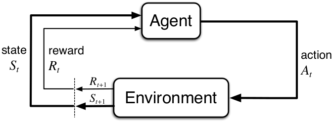

Author: Jelena Kocic, July 2018.

*Learning resources: RL Course by David Silver-DeepMind, Udacity-DRLND, arXiv, booxs and many others*

# Deep Reinforcement Learning

## 1. Introduction

Reinforcement Learning is a form of learning in which a software agent observes the environment and takes actions to maximize its rewards from the environment.

Machine learning paradigms:
- Supervised Learning: y=f(x)
- Unsupervised Learning: f(x)
- Reinforcement Learning: y=f(x), z

#### Reinforcement Learning vs Supervised Learning

Reinforcement learning is different from supervised learning in the sense that there are no labels in advance to tune the parameters of the model. The model learns from the rewards received from the runs. Although the short-term rewards are available instantly, long-term rewards are only available after a couple of steps. This is also known as delayed feedback.

#### Reinforcement Learning vs Unsupervised Learning

Reinforcement learning is also different from unsupervised learning because in unsupervised learning there are no labels available, whereas in reinforcement learning the feedback is available in terms of the rewards.

Unsupervised learning mainly deals with finding structure in data.

Reinforcement learning use an agent that knows if a move is good or bad, by the reward it gets. A bad action in a particular state will have less reward than a good action. 

Reinforcement learning is different from unsupervised learning, which is typically about finding structure hidden in collections of unlabeled data. The terms supervised learning and unsupervised learning would seem to exhaustively classify machine learning paradigms, but they do not. *Although one might be tempted to think of reinforcement learning as a kind of unsupervised learning because it does not rely on examples of correct behavior, reinforcement learning is trying to maximize a reward signal instead of trying to find hidden structure.* Uncovering structure in an agent's experience can certainly be useful in reinforcement learning, but by itself does not address the reinforcement learning problem of maximizing a reward signal. We therefore consider reinforcement learning to be a third machine learning paradigm, alongside supervised learning and unsupervised learning and perhaps other paradigms.

#### Introduction to Deep Reinforcement Learning- The RL Framework

Interpret the Policy
A policy determines how an agent chooses an action in response to the current state. In other words, it specifies how the agent responds to situations that the environment has presented.

### Documentary, Videos 

[AlphaGo - The Movie](https://www.youtube.com/watch?v=WXuK6gekU1Y&t) (Full Documentary)

[Introduction to Reinforcement learning with David Silver](https://www.youtube.com/watch?v=2pWv7GOvuf0&list=PLqYmG7hTraZBiG_XpjnPrSNw-1XQaM_gB) (DeepMind)

## 2. Reinforcement Learning - Intro

### 2.1. Introduction to Reinforcement Learning

jdska

### 2.2. Markov Decision Process

dkszl

### 2.3. Planning by Dynamic Programming

dkszl

### 2.4. Model-Free Prediction

dkszl

### 2.5. Model Free Control

dkszl

### 2.6. Value Function Approximation

dkszl

### 2.7. Policy Gradient Methods

dkszl

### 2.8. Integrating Learning and Planning

dkszl

### 2.9. Exploration and Exploitation

dkszl

### 2.10. Classic Games

dkszl

## 3. Deep Reinforcement Learning

### 3.1. Foundations of RL
(Classical RL problems)
dsadas

### 3.2. Value-Based Methods

#### Navigation
*(Use NN to train an agent that learns intelligent behaviors from sensory data.)*

### 3.3. Policy-Based Methods

#### Continuous Control
*(Train a robotic arm to reach target locations, or train a four-legged virtual creature to walk.)*

dsadas

### 3.4. Multi-Agent Reinforcement Learning

#### Collaboration and Competition
*(Train a system of agents to demonstrate collaboration or cooperation on a complex task.)*

Multi-agent communication:

Communication lats the foundation for multi-agent cooperation, e.g.:
- Intelligent Transportation Systems
- Autonomous Driving
- Moba Game

